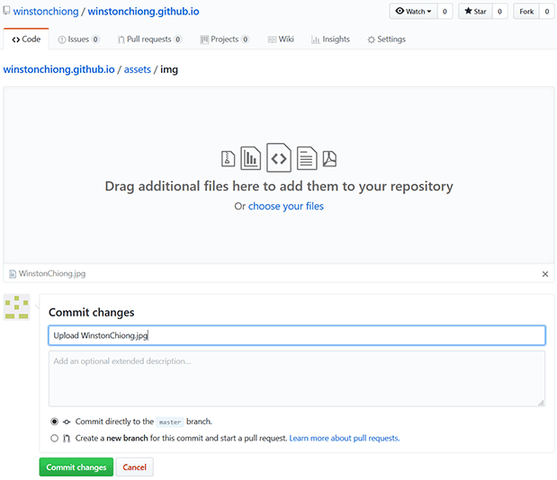
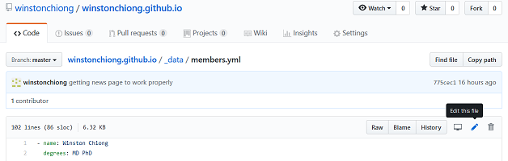
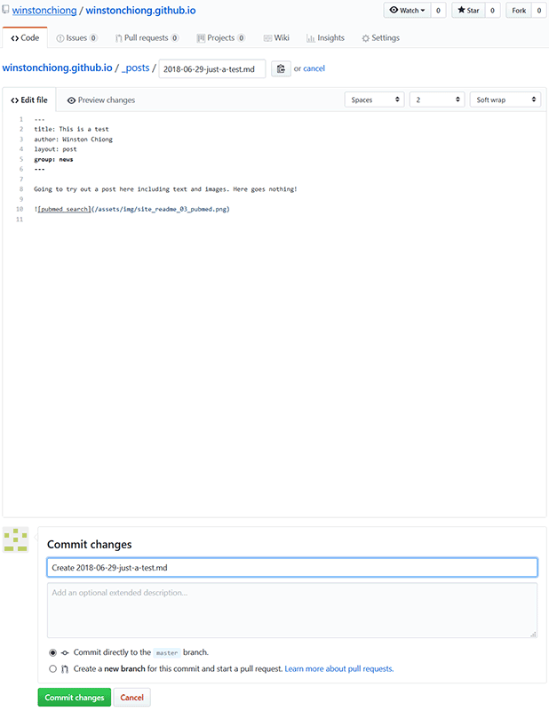

# Decision Lab website

A quick way for everyone to learn how to use GitHub and Markdown. (Site design 
based on [al-folio](https://github.com/alshedivat/al-folio).)

## The super-basics
Hopefully, everyone in the lab will be able to:
- [Update their own "team" profile](#how-to-update-or-add-a-team-profile)
- [Update the list of publications](#how-to-update-the-publication-list)
- [Add news posts](#how-to-add-news-posts)

To do this, you'll first need to understand a little about: 
1. **GitHub**. For our purposes, you can think of GitHub as being like 
supercharged Google Docs for code. Multiple people can work on the same code, it 
keeps track of who made what changes and when, it's easy to reverse changes that 
have been made, and different versions can be developed at the same time. One 
nice feature for our site: instead of directly editing in HTML (which is not a 
language really meant for humans to understand), you'll be giving GitHub 
information in two human-readable formats, which a GitHub tool called Jekyll 
will use to generate the HTML. 
2. **Markdown**. This README.md file is written in Markdown. Markdown allows 
for simple formatting like **bold** (double asterisks like this: `**bold**`), 
*italics* (single asterisks like this: `*italics*`), and 
[hyperlinks](http://www.ucsf.edu) (put the linked text in square brackets 
immediately followed by the address in parens, like: 
`[hyperlinks](http://www.ucsf.edu)`). See 
[this cheatsheet](https://github.com/adam-p/markdown-here/wiki/Markdown-Cheatsheet) 
for more details; you can also check out the markdown in this README file by 
opening 
[decisionlabucsf.github.io/README.md](https://github.com/decisionlabucsf/decisionlabucsf.github.io/blob/master/README.md) 
and clicking "Raw."
3. **YAML**. YAML is a structured data format that uses space-indents 
(no tab-indents!) to show structure and uses colons to associate fields with 
values. For example:
    ```
    - name: Alex Beagle
      position: Medical Student
      email: alex.beagle (at) ucsf.edu
    - name: Julia Heunis
      position: Medical Student
      email: julia.heunis (at) ucsf.edu
    - name: Carson Quinn
      position: Medical Student
      email: carson.quinn (at) ucsf.edu
    ```
    This list has three entries. Each entry has fields for name, position, and 
    e-mail address. Note that you don't have to put strings within quotation 
    marks, although sometimes this is helpful if your string has special 
    characters like colons or quotation marks. You can also often embed Markdown 
    code like asterisks in these strings. 
    
## How to update (or add) a team profile
Two steps:
### 1. If you don't have one yet, add a picture to /assets/img/
A good size for team member pictures on this site is 311 pixels wide, in jpeg or 
png format. Name your picture file something descriptive that won't be mistaken 
for any other image on the site (like `team_your-name.jpg` -- underscores to 
separate kinds of info and hyphens to break up words). Navigate to 
[/assets/img/](https://github.com/decisionlabucsf/decisionlabucsf.github.io/tree/master/assets/img) 
and drag-and-drop the picture file from your desktop into the browser window. 
You'll then be asked to make a "commit":



In the box below **Commit changes**, instead of "Add files via upload" type in a 
more informative description like "upload `YOUR FILENAME` for members.yml" and 
click the green button to commit the file directly to the master branch.

### 2. Edit the team member data in the YAML file /_data/members.yml
Navigate to [/_data/members.yml](https://github.com/decisionlabucsf/decisionlabucsf.github.io/blob/master/_data/members.yml) 
and click the pencil for "Edit this file":



If you already have a profile, you'll see fields for your name, degrees, 
position, e-mail address and so forth. E.g.:

```
- name: Ali Zahir
  image: team_Ali-Zahir.jpg
  altimage: 
  position: Research Coordinator
  email: ali.zahir (at) ucsf.edu
  scholar: 
  twitter: 
  description: Ali, a clinical research coordinator working for Dr. Winston Chiong, currently oversees 
              the coordination of a number of studies which center around decision-making in the aging brain, 
              with a particular focus on how brain structures involved in financial and medical decisions are...
```
If you don't yet have a profile, you'll need to create a new one roughly 
matching the format of the existing entries. (The entries will be displayed on 
the site in the same order that they are here, so put yours in the appropriate 
place.) Each entry begins with a hyphen and a space, and then each subsequent 
part of that entry needs to be preceded by at least two spaces. If you added a 
picture in the previous step, type in the filename you assigned it after `image: `. 
Not every field needs to be filled in, e.g. if you don't have or don't want to 
list a twitter account. After `description: ` give yourself a quick bio. Feel 
free to write two or three paragraphs in the first person, include something 
about how you've gotten interested in neuroscience or working with patients, 
and maybe something about yourself outside of work. Three carriage returns makes 
a new paragraph, as long as all the lines in the description are indented to the 
same degree. 

At the bottom of the page you'll see another **Commit changes** box. In the box 
below, you can write something like "Update members.yml to include `YOUR NAME`" 
and click the green button to commit the file directly to the master branch. 

After you commit, it might take a minute or two to see these changes reflected 
in the "team" page, and you might need to refresh your browser. 

## How to update the publication list

For journal articles and reviews: no book chapters, letters to the editor, 
conference abstracts, etc.

### 1. Get citation from PubMed
Start by going to [pubmed.gov](http://pubmed.gov) (or 
[pubmed.ucsf.edu](http://pubmed.ucsf.edu) from campus) to find the article. (You 
can enter the title or search for Winston's articles by putting `chiong w [au]` 
in the search bar.) Just to the left of each paper entry is a checkbox, a 
numeral and the word "Cite." Click on "Cite" and you can copy a citation for 
the paper of interest, in AMA format (a version of Vancouver).

### 2. Find a publication image and upload
If this is a quantitative paper, try to find the most interesting or revealing 
figure from the paper. Click on the article link to bring up that individual 
article's PubMed abstract, and follow the Full Text Links (such as UC-eLinks) to 
the paper. IF you see a good image, download it and save it to your computer in 
PNG or JPEG format with a short descriptive name like 
"`pubs_YEAR_ARTICLE-KEYWORDS.png`". (Even better: use Photoshop or other editing 
software to resize to a width of 185 pixels.)

If it's a qualitative or ethics paper that doesn't have useful figures, see if 
you can find a freely-usable image that fits with the theme. Two sources here 
are [unsplash.com](https://unsplash.com) and Google Images--if you're using the 
latter, click on "Tools" and select "Usage Rights -> Creative Commons licenses 
for freely-usable images. 

Use the methods described above in *(1. If you don't have one yet, add a 
picture to /assets/img/)* to upload the publication image to 
[/assets/img/](https://github.com/decisionlabucsf/decisionlabucsf.github.io/tree/master/assets/img). 

### 3. Edit the publication data in /_data/publications.yml
Use the same methods described above *(2. Edit the team member data in the YAML 
file /_data/members.yml)* to edit 
[publications.yml](https://github.com/decisionlabucsf/decisionlabucsf.github.io/blob/master/_data/publications.yml). 
This list contains publications in reverse chronological order, try to put the 
new article in the right place. Use the Vancouver-formatted text file that you 
downloaded to your computer to fill out these data entries, roughly matching the 
format of the existing entries, e.g.:
```
- authors: "**Chen BB**, **Haeusermann T**, **Dada A**, Hamilton RH, James JE, 
           **Fong KC**, Dohan D, **Chiong W**."
  title: "Race-ethnicity, rurality, and age in prospective preferences and 
         concerns regarding closed-loop implanted neural devices."
  details: "Journal of Neuropsychiatry and Clinical Neurosciences. 2024 
           Aug 22:appineuropsych20230190. Online ahead of print." 
  year: 2024
  image: pubs_2024_prospective-closed-loop.png
  imagealt: "Figure 1 of paper: Survey Weighted Proportions of US Adults' 
            Preferences and Perceptions Regarding Closed-Loop Brain Implants."
  imagecredit:
  pmid: 39169740
  pmcid: 
  openaccess: 
  doi: 10.1176/appi.neuropsych.20230190
  file: 
  filetype: 
  github:
  biorxiv:
  psyarxiv: 
  contentshare: 
  preregistered: https://osf.io/ej9h2
  opendata: https://osf.io/3t2p6
  openmaterials: https://osf.io/3t2p6


```
In `authors: ` use double asterisks (`**Name**`) to highlight lab members' 
names. For consistency, keep the final period `.` at the end of the string for 
`authors: `, `title: ` and `details: `, and change the title to 
[sentence case](https://en.wikipedia.org/wiki/Letter_case#Sentence_case) if 
necessary. Also under `details: `, spell out the actual journal title but leave 
out "The" at the beginning of journal 
titles, e.g. "~~The~~ Journal of XYZ." After `image: `, enter the name of the 
publication image you uploaded to 
[/assets/img/](https://github.com/decisionlabucsf/decisionlabucsf.github.io/tree/master/assets/img) 
in the previous step. Relatedly, `imagealt: ` is for a brief description of the 
image to be used by screen readers to make the page more accessible to visually 
impaired people (and other people who use screen readers). If the image is a 
figure from the paper, just give the figure number and figure title from the 
paper, as above. If the image is a freely-usable image we've gotten from 
somewhere to fit the theme of the paper, give a brief description of the image 
itself. And `imagecredit: ` is for giving credit to people when we've uploaded 
a freely-usable image we've gotten online, e.g. 
`imagecredit: photo by Ramiro Pianorosa on Unsplash`.

Add the "pmid" (the PMID or PubMed ID number, usually 9 
digits), the "pmcid" (the PMCID or PubMed Central ID number, usually the letters 
"PMC" followed by a string of numerals) and the DOI number from the PubMed 
abstract for the article. 

**Commit changes** when you're done, using the green button to commit the file 
directly to the master branch and the description box below to leave a brief 
description. 

### 4. More options: self-hosting files, preprints, open science
In the entry above, there were several options after `doi: ` that were not all 
filled in. `openaccess: ` is for articles that are Gold OA--that is, for which 
anyone can read the formatted article on the website. `contentshare: ` is a bit 
similar, in which authors have a link that provides access that they can share 
with others. If the article is either of those, enter the URL where the paper 
can be found. 

In some cases, if a paper is not Gold OA or we don't have a Content Sharing 
link, we will want to host PDFs of our papers 
so that people who don't 
have journal subscriptions can read them. Each journal has different policies 
about whether they allow this for articles published in their journal - you 
should check the journal's website (there's a general database on this called 
[SHERPA/RoMEO](http://sherpa.ac.uk/romeo/index.php) that's also worth 
consulting.) We are interested in what 
[RoMEO calls](http://sherpa.ac.uk/romeo/definitions.php?la=en&fIDnum=|&mode=simple&version=#colours) 
"green" and "blue" archiving policies. That is, we want to post versions that 
are word-for-word identical to the final version, whether this is what we call 
the "pdf - published version" (including all the typesetting and formatting of 
the journal), or the "pdf - author manuscript version (peer-reviewed & edited)" 
(final text including changes from peer review, but without the fancy journal 
formatting). We don't want to host the "pre-print" or "original version," which 
is the version of papers prior to peer review. 

If we are self-hosting a paper on our website, rename the document file as 
"`AUTHORS` - `TITLE`.pdf" and place it in 
[/assets/papers/](https://github.com/decisionlabucsf/decisionlabucsf.github.io/tree/master/assets/papers). 
Then in the entry for `file: ` enter the document name, and in the entry for 
`filetype: ` indicate whether this is a "pdf - published version" or a "pdf -
 author manuscript version (peer-reviewed & edited)."

Finally, `biorxiv: ` and `psyarxiv: ` are options for papers in which we've 
posted a preprint prior to publication; `preregistered: ` allows us to link to 
preregistrations for a paper, and `opendata: ` and `openmaterials: ` allow us to 
link to repositories where readers can download our data and materials (e.g., if 
they're interested in reproducing our analyses or our experiments).

## How to add news posts
For this you will create a Markdown file containing the news post. Navigate to 
[/_posts/](https://github.com/decisionlabucsf/decisionlabucsf.github.io/tree/master/_posts) 
and click **Create new file**. 



The filename must begin with the date in YYYY-MM-DD format, followed by a brief 
title delimited by hyphens and then the extension `.md`. The post must begin 
with these six lines:
```
---
title: 
author: 
layout: post
group: news
---
```
For `title: `, enter the post title as you want it to appear on the News page. 
For `author: `, enter your own name as it is spelled in 
[/_data/members.yml](https://github.com/decisionlabucsf/decisionlabucsf.github.io/blob/master/_data/members.yml). 
If you would like to include an image, upload a JPEG or PNG file to 
[/assets/img/](https://github.com/decisionlabucsf/decisionlabucsf.github.io/tree/master/assets/img) 
(ideally, with a width of 490 pixels) and include a tag in your post using the 
format:
```

```
where for `ALT-TITLE` you put in a brief description and for `FILENAME` you 
enter the filename of the image you uploaded to 
[/assets/img/](https://github.com/decisionlabucsf/decisionlabucsf.github.io/tree/master/assets/img). 
(I suggest naming it something like "news_YEAR_key-words.png".)

When you're done, **commit changes**, using the green button to commit the file 
directly to the master branch and the description box below to leave a brief 
description.
